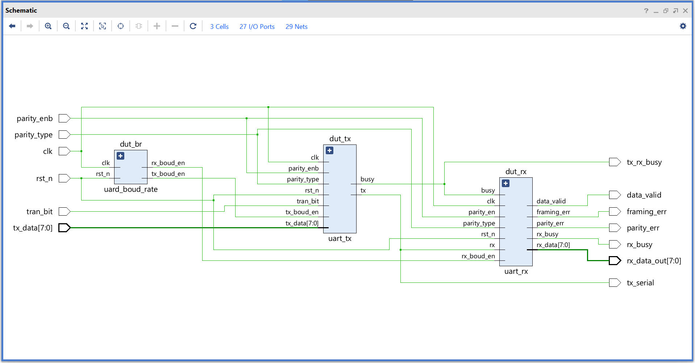
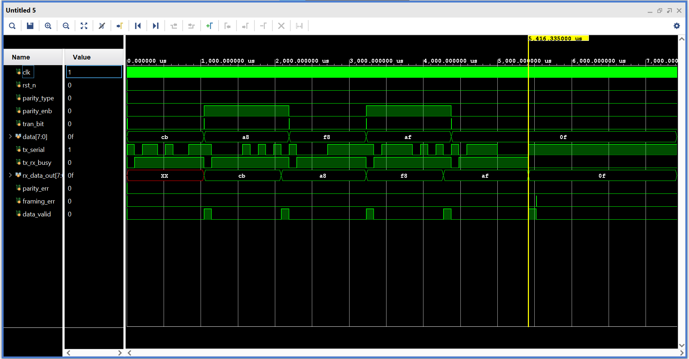
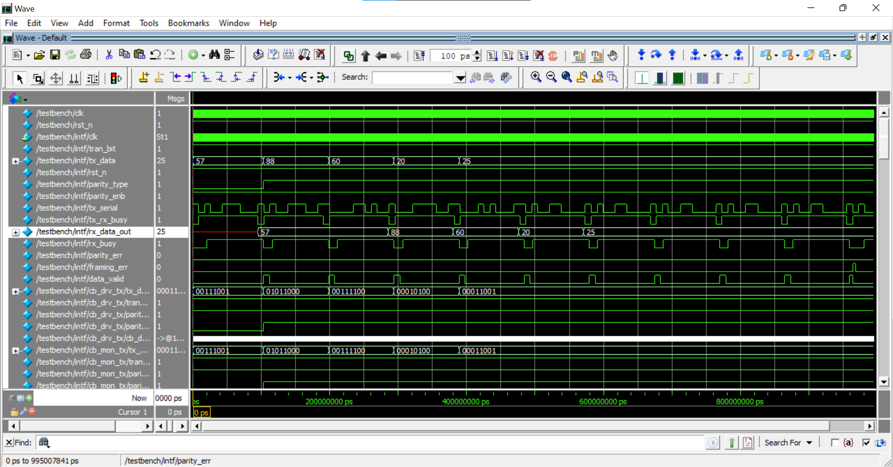
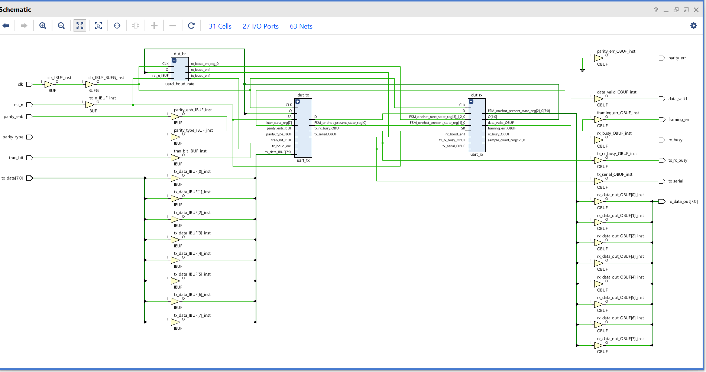
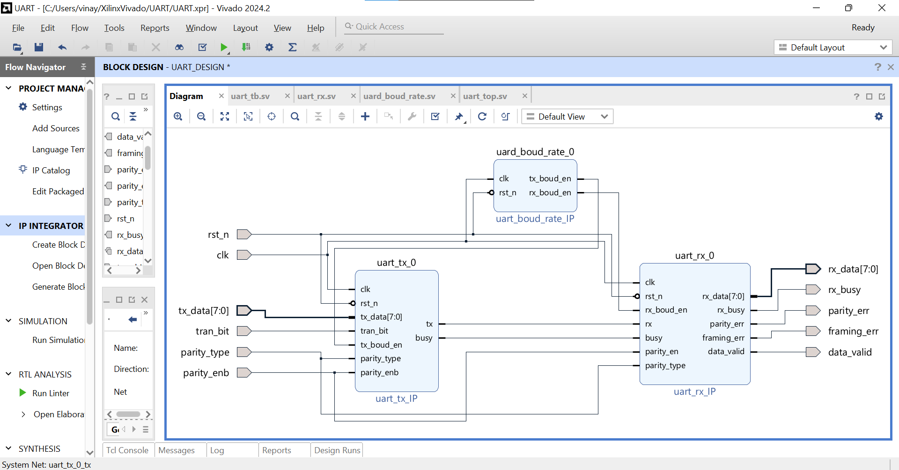

<h1>
  UART Protocol Design and Verification with IP
</h1>

  This repo contains Verilog and SystemVerilog code for an UART_Protocl Design.

<body>
  <!-- Table of Contents -->
  <h2>Table of Contents</h2>
  <ul>
    <li><a href="#author">Author</a></li>
    <li><a href="#introduction">Introduction</a></li>
    <li>
      <a href="#design">Design Space Exploration and Design Strategies</a>
      <ul>
        <li>
          <ul>
            <li><a href="#operations">Operations</a></li>
          </ul>
        </li>
        <li><a href="#signals">Signals Definition</a></li>
        <li>
          <a href="#modules">Dividing System Into Modules</a>
            <ul>
              <li><a>uart_top.sv</a></li>
              <li><a>uart_tx.sv</a></li>
              <li><a>uart_rx.sv</a></li>
              <li><a>uart_boud_rate.sv</a></li>
            </ul>
        </li>
      </ul>
    </li>
    <li>
      <a href="#testbench">Testbench Case Implementation</a>
      <ul>
        <li><a href="#waveforms">Waveforms</a></li>
      </ul>
    </li>
    <li>
      <a href="#systemverilog">System Verilog Enviroment Verification</a>
      <ul>
        <li><a href="#execution">Compile and Execution</a></li> 
        <li><a href="#Verification">Verification Waveforms</a></li>
      </ul>
    </li>
    <li><a href="#results">Results</a></li>
    <li><a href="#conclusion">Conclusion</a></li>
    <li>
          <a href="#Custom IP Design Extension">Custom IP Design Extension</a>
            <ul>
              <li><a href="#Async_FIFO_design_1_wrapper.v">Async_FIFO_design_1_wrapper.v</a></li>
            </ul>
        </li>
    <li><a href="#references">References</a></li>
  </ul>

  <!-- Sections -->
  <h2 id="author">Author</h2>
  
Vinayak Ghate

<h2 id="introduction">Introduction</h2>

  This project presents the design and verification of a configurable <strong>UART (Universal Asynchronous Receiver/Transmitter)</strong> module,
  developed to achieve reliable <strong>serial communication</strong> between digital systems. The main objective
  is to ensure correct data transmission and reception while supporting configurable baud rates, data width, parity, and stop bits.

  The UART employs independent <strong>transmitter (TX)</strong> and <strong>receiver (RX)</strong> modules, each handling
  data serialization and deserialization, respectively. To ensure accurate data capture at the receiver, the design includes
  a <strong>baud rate generator</strong> that produces precise sampling pulses based on the system clock. Optional <strong>START, </strong>
  <strong>PARITY</strong> and <strong>STOP bit</strong> logic are implemented to enhance data integrity.

  The design uses a modular approach, separating the transmitter, receiver, and baud rate generator into different
  Verilog files. Verification is performed with a <strong>SystemVerilog testbench</strong> environment, including
  monitors and scoreboards, ensuring correct operation under various data patterns, baud rates, and timing scenarios.

<ul style="text-align: justify;">
  <li>The UART design ensures reliable serial communication across different configurations and system clocks.</li>
  <li>SystemVerilog-based testbench verification validates TX/RX data integrity, start/stop bit correctness, and optional parity handling.</li>
  <li>The approach provides a practical and reusable UART module suitable for FPGA and ASIC integration.</li>
</ul>

  Overall, this UART design provides a robust mechanism for asynchronous serial data transfer, combining
  configurable timing, modular architecture, and thorough functional verification.

<h2 id="design">Design Space Exploration and Design Strategies</h2>

 The block diagram of the UART implementation in this repository is as follows. Thin lines represent single-bit signals (like control signals),
 while thick lines represent multi-bit data buses (such as <code>tx_data[7:0]</code> and <code>rx_data[7:0]</code>).

<!-- 🖼️ Example image block -->

  
  
Figure 1: UART Architecture showing TX, RX, and Baud Rate Generator modules.

 <h3 id="operation">UART Data Transmission and Reception Operations</h3>
<h4 id="operations">Operations</h4>

  In a UART communication protocol, data transmission and reception are managed by the transmitter (TX) and receiver (RX) modules. 
  The <strong>TX module</strong> takes parallel data as input, serializes it by adding start, optional parity, and stop bits, 
  and then sends it out through the <code>tx_serial</code> line. The <strong>RX module</strong> receives this serial data, 
  detects the start bit, samples the incoming bits at the configured baud rate, checks optional parity, and reassembles the parallel data. 
  Once a full byte is received correctly, the <code>rx_data_valid</code> signal is asserted.

<h4 id="conditions">Start, Stop, and Parity Conditions</h4>

  The following conditions govern UART data transmission and reception:

<ul>
  <li>
    <strong>Start Bit:</strong>  
    Each UART frame begins with a start bit (logic 0) to indicate the beginning of a data packet. 
    The receiver detects this falling edge to start sampling the incoming data.
  </li>

  <li>
    <strong>Data Bits:</strong>  
    After the start bit, 5 to 8 data bits are transmitted (configurable). The TX module shifts out each bit serially, 
    while the RX module samples each bit at the baud rate.
  </li>

  <li>
    <strong>Parity Bit (Optional):</strong>  
    If parity is enabled, an additional parity bit is transmitted to provide basic error detection. 
    The RX module checks the parity and asserts <code>parity_err</code> if a mismatch occurs.
  </li>

  <li>
    <strong>Stop Bit:</strong>  
    Each UART frame ends with one or more stop bits (logic 1). The RX module checks the stop bit(s) to confirm proper frame reception.
  </li>
</ul>

  This design ensures reliable asynchronous serial communication between devices, with configurable parameters such as clk_freq, boud_rate, parity, and stop bits.

<h3 id="signals">Signals Definition</h3>

  The following signals are used in the UART design:

  <strong><code>clk</code></strong> : System clock signal. 
  <strong><code>rst_n</code></strong> : Active-low reset signal. 
  <strong><code>tx_data[7:0]</code></strong> : Parallel input data to the TX module. 
  <strong><code>trans_bit</code></strong> : Input signal indicating TX data is valid and ready to send. 
  <strong><code>tx_serial</code></strong> : UART serial output from TX module. 
  <strong><code>rx_serial</code></strong> : UART serial input to RX module. 
  <strong><code>rx_data[7:0]</code></strong> : Parallel output data from RX module. 
  <strong><code>rx_data_valid</code></strong> : Signal asserted when a valid byte is received. 
  <strong><code>baud_rate</code></strong> : Parameter defining the UART baud rate. 
  <strong><code>parity_enb</code></strong> : Enables parity checking. 
  <strong><code>parity_type</code></strong> : Selects even or odd parity. 
  <strong><code>tx_busy</code></strong> : Indicates TX module is currently transmitting. 
  <strong><code>rx_busy</code></strong> : Indicates RX module is currently receiving. 
  <strong><code>parity_err</code></strong> : Flag asserted when parity error is detected. 
  <strong><code>framing_err</code></strong> : Flag asserted when stop bit(s) are incorrect. 

<h3 id="modules">Modules Overview</h3>
<ol>
  <li>
    <a href="rtl_file/uart_top.sv"><code>uart_top.sv</code></a>: Top-level wrapper module integrating the TX, RX, and baud rate generator. Connects all submodules and exposes top-level I/O signals.
  </li>
  <li>
    <a href="rtl_file/uart_tx.sv"><code>uart_tx.sv</code></a>: UART Transmitter module. Handles data serialization, adding start/stop bits, optional parity, and sends serial data through <code>tx_serial</code>. Controls <code>tx_busy</code> during transmission.
  </li>
  <li>
    <a href="rtl_file/uart_rx.sv"><code>uart_rx.sv</code></a>: UART Receiver module. Detects start bit, samples incoming serial data at configured baud rate, checks optional parity, and outputs parallel <code>rx_data[7:0]</code>. Sets flags <code>rx_valid</code>, <code>parity_err</code>, and <code>framing_err</code>.
  </li>
  <li>
    <a href="rtl_file/uart_boud_rate.sv"><code>uart_boud_rate.sv</code></a>: Baud rate generator module. Produces enable ticks for TX and RX based on system clock (<code>clk</code>) and configured baud rate (<code>baud_rate</code>), using the formula:
     
    <code>baud_tick = clk / (baud_rate × oversampling_factor)</code>
  </li>
  <li>
    <a href="rtl_file/uart_tb.sv"><code>uart_tb.sv</code></a>: Testbench module. Provides self-checking verification by generating random TX data, monitoring RX outputs, validating start/stop bits and parity, and reporting errors automatically.
  </li>
</ol>

<h2 id="uart_testbench">UART Testbench Case Implementation</h2>
<h3 id="tb_uart">tb_uart.sv</h3>

  <a href="rtl_file/tb_uart.sv"><code>tb_uart.sv</code></a> is the testbench for the UART modules. It generates random TX data, sends it through the transmitter, and checks the received data at the RX module.

Test cases included:

<ol>
  <li>Transmit and receive single bytes – verifies basic UART functionality.</li>
  <li>Transmit multiple bytes – checks correct sequencing and data integrity.</li>
  <li>Test optional parity and stop bits – checks parity and framing error detection.</li>
  <li>Test TX when busy – verifies TX busy signal behavior.</li>
  <li>Test RX when idle – verifies RX_valid and error flags.</li>
</ol>

The testbench uses a system clock, UART clocks, and reset signals, and finishes after all test cases.

<h3 id="uart_waveforms">Waveforms</h3>

  Figure 8: RTL simulation waveform of <code>tb_uart.sv</code> (Generated by Vivado)

>

<h2 id="systemverilog">SystemVerilog Verification Environment</h2>

  The SystemVerilog verification environment is designed to verify the functional correctness of the UART design. It ensures that data transmitted by <code>uart_tx.sv</code> is correctly received by <code>uart_rx.sv</code>, while monitoring control signals like <code>tx_busy</code>, <code>rx_data_valid</code>, and optional parity or framing errors. The environment is developed in SystemVerilog and simulated using <strong>ModelSim</strong>, with waveforms generated for analysis.

<h3 id="testbench">testnech.sv/h3>

  <a href="sv_file/testbench.sv"><code>uart_tb.sv</code></a> is the top-level testbench for the UART design. It instantiates the DUT (transmitter and receiver) and connects it with the verification components such as generator, driver, and monitor. The testbench generates system clocks, reset signals, and drives stimulus into the DUT. It also collects and checks responses for correctness.

<h3 id="uvm_components">Verification Components</h3>

<ol>
  <li>
    <a href="sv_file/generator.sv"><code>generator.sv</code></a>: Generates random or predefined UART data patterns to feed into the transmitter. It controls the timing of <code>tx_data, </code><code>parity_type,</code> <code>parity_enb</code> and <code>trans_bit</code> signals.
  </li>
  <li>
    <a href="sv_file/driver.sv"><code>driver.sv</code></a>: Receives data from the generator and drives the DUT input ports, including <code>tx_data</code> and <code>wr_trans_biten</code>. Ensures correct handshaking with DUT signals.
  </li>
  <li>
    <a href="sv_file/monitor.sv"><code>monitor.sv</code></a>: Observes DUT outputs, including <code>rx_data</code>, <code>rx_data_valid</code>, <code>parity_err</code>, and <code>framing_err</code>. Collects data for checking correctness and reports any mismatches.
  </li>
  <li>
    <a href="sv_file/scoreboard.sv"><code>scoreboard.sv</code></a>: Compares transmitted and received data to ensure the DUT works correctly. Flags any mismatch between sent and received bytes.
  </li>
</ol>

<h3 id="execution">Simulation Execution</h3>

  The simulation was run in <strong>ModelSim</strong>. The waveforms show transmitted and received data along with control signals such as <code>tx_busy</code>, <code>rx_data_valid</code>, <code>parity_err</code>, and <code>framing_err</code>. The verification components (generator, driver, monitor, scoreboard) ensure data integrity and proper signal operation.

  

    Figure: Simulation waveform of <code>testbench.sv</code> showing data transmission, reception, and control signals (Generated by ModelSim)
  

  The waveform confirms that the UART design correctly transmits and receives data, properly sets busy and valid signals, and detects parity or framing errors when configured.

<h2 id="results">Results</h2>

<h3>1. Tools Used</h3>
<ul style="text-align: justify;">
  <li><strong>Xilinx Vivado:</strong> Used for RTL design, synthesis, and schematic generation.</li>
  <li><strong>ModelSim:</strong> Used for SystemVerilog testbench simulation, waveform generation, and functional verification.</li>
  <li><strong>GitHub:</strong> Used to manage and version-control all UART design and verification files.</li>
</ul>

<h3>2. Synthesis Result</h3>

  The UART design was successfully synthesized on <strong>Xilinx Vivado</strong> for a standard configuration of 8-bit data width and 115200 baud rate. 
  The synthesis report indicates that the design meets timing requirements and is able to operate at the target system frequency.

  Combined with simulation in Xilinx Vivado, the synthesized design demonstrates correct data transmission and reception, proper start/stop bit handling, and optional parity/error checking.

  
  

    Figure: Simulation waveform showing UART transmission, reception, and control signal behavior.
  

<h2 id="conclusion">Conclusion</h2>

  The UART design and verification were successfully completed, ensuring reliable 
  <strong>data transmission and reception</strong> with proper handling of start/stop bits and optional parity.

  Simulation confirmed correct functionality, and the SystemVerilog verification environment validated 
  <strong>stable data transfer</strong> and <strong>error-free operation</strong> across independent clock domains.

  Overall, the design is robust, scalable, and ready for FPGA/ASIC implementation, with potential for 
  integration into advanced verification frameworks for future work.

<h2 id="custom_ip_design">Custom UART IP Design</h2>

  The UART design is packaged as a reusable, configurable IP block for FPGA/ASIC integration with modular and CDC-safe architecture.

<h3>Key Features</h3>
<ul style="text-align: justify;">
  <li>Configurable <code>CLK_FREQ</code> and <code>BAUD_RATE</code>.</li>
  <li>Modular TX, RX, and Baud Rate Generator.</li>
  <li>CDC-safe operation using baud enable signals.</li>
  <li>Error detection: parity, start/stop, framing errors.</li>
  <li>Supports multiple baud rates and multi-clock systems.</li>
</ul>

<h3>IP GUI & Wrapper</h3>

  
  

    Figure: Simulation waveform showing UART transmission, reception, and control signal behavior.
    Figure: UART IP design GUI (TX, RX, Baud Rate Generator)
  

<h2 id="references">References</h2>

<ul style="text-align: justify;">
  <li>
    SystemVerilog Verification Environment: From Basics to Advanced.  
    (Udemy course used for functional verification concepts applied during ModelSim simulations.)
  </li>

  <li>
    IEEE Standard for Verilog and SystemVerilog (IEEE Std 1364-2005, IEEE Std 1800-2017).  
    (Reference for language syntax and verification semantics.)
  </li>

  <li>
    ModelSim User Manual.  
    (Used for simulation and waveform analysis during verification of UART designs.)
  </li>

  <li>
    Xilinx Vivado Design Suite Documentation, Xilinx Inc.  
    (Referred to as a learning resource for digital design flow and FPGA synthesis understanding.)
  </li>

  <li>
    ALL_ABOUT_VLSI iLearn Platform: UART Protocol Design and Implementation.  
    (Provided detailed guidance on UART transmitter/receiver design, baud rate configuration, and FPGA implementation.)
  </li>

</ul>

</body>

